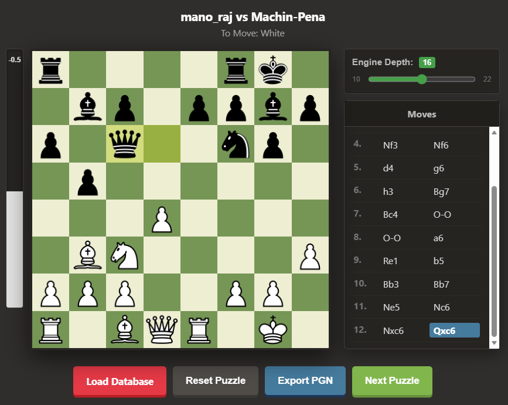

# CyberPuzzle

### features
- allow import custom games (games you played/ lichess elite games)
- auto generate puzzle position by picking a ~~relative equal~~ random position
- show the classic move feedback (best to blunder) for your move
- show engine eval bar for reference
- engine then play the best move after your move
- you can takeback/ move back in history and change move
- export pgn to analysis on another tool

